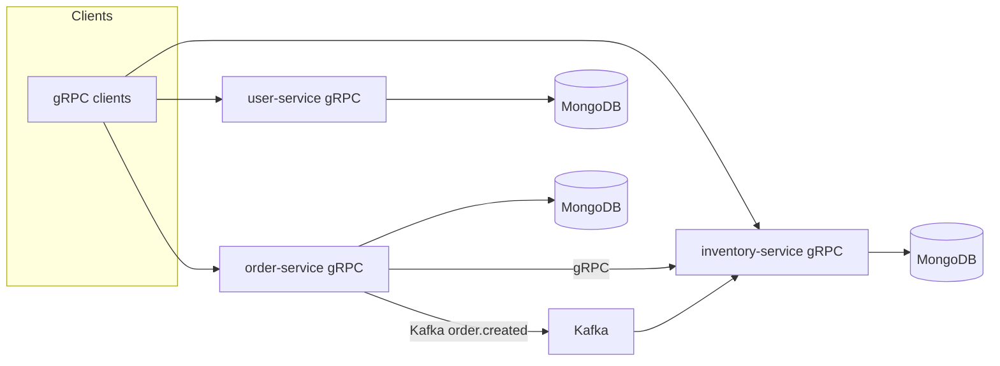

# Project progress

Last reviewed: **2026-04-06** (from repository snapshot).

## Vision

A small **business platform** expressed as **microservices** in Go: users/authentication, orders, and inventory, with **MongoDB** persistence and **Kafka** for asynchronous order-related notifications. Services expose **gRPC** APIs defined in Protocol Buffers; **HTTP** adapters exist in order and inventory code but are **not started** in the current `app` wiring (commented out).

## What exists today

### Repository layout

| Area | Contents |
| --- | --- |
| `user-service/` | gRPC `Auth` service: register, authenticate, user profile; MongoDB; bcrypt hashing; SMTP mailer |
| `order-service/` | gRPC `OrderService`: create/get/update/list orders; MongoDB; Kafka **producer** on topic `order.created`; gRPC **client** to inventory |
| `inventory-service/` | gRPC `InventoryService`: CRUD-style product APIs; MongoDB; Kafka **consumer** on `order.created` |
| `docker-compose.yml` | Redis, Zookeeper, Kafka (no MongoDB service) |

### Architecture (high level)

### Implementation maturity

- **Clean-ish layering**: `domain` → `usecase` → `adapter` (gRPC, mongo, kafka, mail) with `cmd` + `config` + `pkg`.
- **Protos**: Checked-in generated Go under `protos/gen/golang/`; `Taskfile.yaml` documents regeneration.
- **Events**: `events.proto` present in order/inventory for event shapes; producer topic name is hardcoded as `order.created` in application code.
- **Testing**: `user-service` has `user_usecase_test.go`; broaden coverage is an open area.

## Gaps and follow-ups

These are honest deltas from an ideal “production-ready” posture; prioritize as you prefer.

1. **Root README** — None yet; `create.md` covers setup.
2. **MongoDB in Compose** — Developers must supply Mongo separately or extend `docker-compose.yml`.
3. **HTTP APIs** — Implementations exist under `internal/adapter/http` for order and inventory but are not registered in `app.New` / `Start`.
4. **order-service app lifecycle** — `internal/app/app.go` constructs Kafka producer and gRPC clients but the returned `App` struct may not assign them; `Stop()` closes `grpcClients` and `kafkaProd`. Worth verifying shutdown and wiring so nil pointers are not dereferenced.
5. **Redis** — Started by Compose; no references found in the Go services in this snapshot.
6. **CI, lint, API gateway, auth between services** — Not present in tree; gRPC is direct service-to-service where implemented.
7. **Security** — SMTP and DB credentials via env; no mTLS or token propagation documented for inter-service gRPC.

## Version pins (reference)

- Go **1.23.5** (user-service `go.mod`; align other modules if they drift).
- gRPC **1.72.x**, protobuf **1.36.x**, mongo-driver **1.17.x** (see individual `go.mod` files for exact pins).

## How to track progress going forward

- Use this file for milestone notes, or move sections into GitHub Issues / a project board.
- After meaningful changes, update **“Last reviewed”** and the **Gaps** list so newcomers see current truth.

## Latest backend upgrades

1. **Order status state machine**
   - Added explicit valid statuses and allowed transitions (`pending -> paid -> shipped -> delivered`, with cancellation only from `pending`).
   - Prevents accidental jumps like `pending -> delivered`.
2. **Better order request validation**
   - Create flow now validates required IDs/items and rejects malformed payloads early.
   - Update flow validates status value before writing to MongoDB.
3. **Safer order-service shutdown**
   - Fixed app wiring to store initialized gRPC clients and Kafka producer in `App`.
   - Added nil-safe close logic in `Stop()` to avoid panic during partial startup failures.
4. **Inventory input validation + pagination defaults**
   - Validates name/category non-empty and price non-negative on create/update.
   - Applies stable list defaults (`page=1`, `limit=20`, max limit clamp) for API consistency.
5. **Interview-friendly tests**
   - Added unit tests for order status validation and transition rules.
